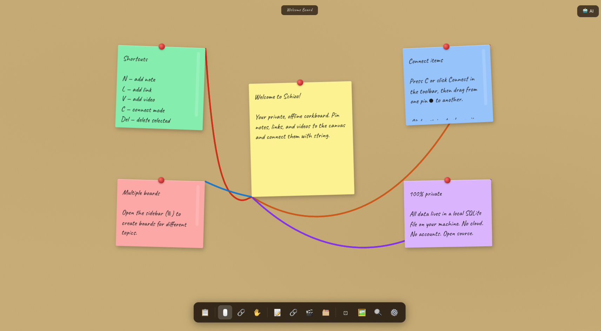

# Schizo

A private, offline corkboard app. Pin notes, links, images, and videos to an infinite canvas and connect them with physically-simulated string.

No cloud. No accounts. All data lives in a local SQLite file on your machine.

## Features

- **Infinite canvas** — pan and zoom freely; cork board aesthetic
- **Item types** — notes, links (with OG preview), images, screenshots, YouTube/Vimeo videos
- **String connections** — connect any two items with colored string; Verlet rope physics with catenary shape
- **Multiple boards** — sidebar to create and switch between boards
- **Nested boards** — embed a board inside another as a portal item
- **Board templates** — Cold Case, Research, Mood Board, or start blank
- **Full-text search** — `⌘K` searches notes, links, images, and videos across all boards
- **Undo/redo** — 50-step history
- **Item locking** — right-click to lock items in place
- **Export** — save any board as a PNG
- **AI assistant** — local [Ollama](https://ollama.com) integration; your model, your machine, no cloud
- **PWA** — installable in-browser, works offline

## Keyboard Shortcuts

| Key | Action |
|-----|--------|
| `N` | Add note |
| `L` | Add link |
| `V` | Add video |
| `B` | Add board portal |
| `C` | Connect mode |
| `F` | Fit all items to view |
| `⌘A` | Select all |
| `⌘C` / `⌘V` | Copy / paste selected |
| `⌘Z` / `⌘⇧Z` | Undo / redo |
| `⌘K` | Search |
| `Del` | Delete selected |
| `Esc` | Cancel / deselect |

## Tech Stack

- [Tauri 2](https://tauri.app) (Rust backend, SQLite via rusqlite)
- React 19 + TypeScript + Vite
- [PixiJS](https://pixijs.com) — WebGL canvas for rope rendering
- Zustand — state management
- Tailwind CSS

## Running Locally

Install prerequisites: [Node.js](https://nodejs.org), [Rust](https://rustup.rs), and the [Tauri prerequisites](https://tauri.app/start/prerequisites/) for your platform.

```bash
npm install
npm run tauri dev
```

To run as a web app only (no native features):

```bash
npm run dev
```

## Building

```bash
npm run tauri build
```

Produces a native installer in `src-tauri/target/release/bundle/`.

## License

MIT
